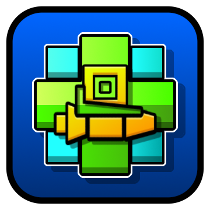

# Icon Preview

This mod lets you preview how your **Cube** icon will look like in-game on top of your chosen ***Ship*** and ***UFO***!
To preview, simply enter the ***Icon Garage***, your selected cube will automatically show up in its position when you select a Ship/UFO icon!

By default, this mod does some funny stuff to ensure proper layering if ***Glow*** is enabled. If this causes any issues, this behavior can be disabled in the mod's settings page!

## Compatibility with other Icon Mods
- **More Icons**: Should be completely compatible and functional!
- **Separate Dual Icons**: Semi-works! Switching P1<->P2 icon sets needs a reload of the icon preview afterwards. (Check mod settings!)
- **Fine Outline**: Works, cube won't have the custom outline color.
- **Icon Gradients**: Works, cube won't have the custom gradient applied.
